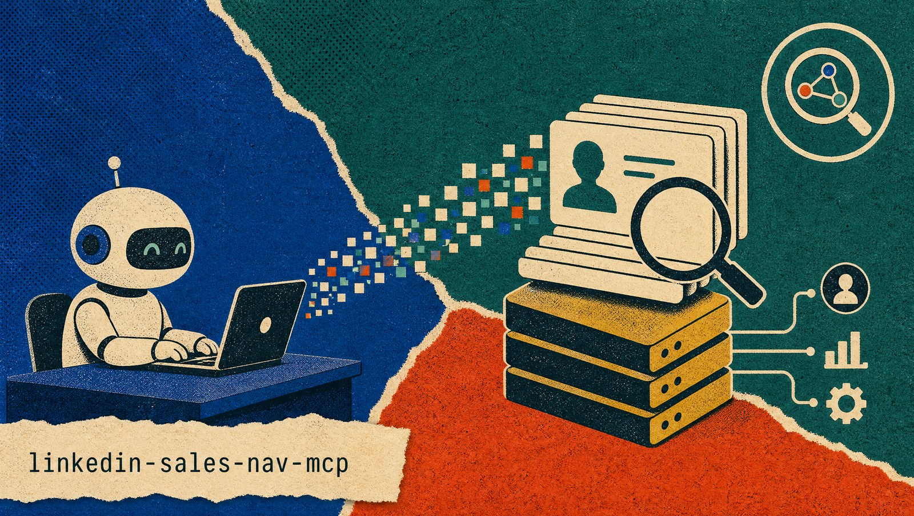

<p align="center">
  
</p>

# LinkedIn Sales Navigator MCP Server

[](https://github.com/nick-choudhary/linkedin-sales-nav-mcp/actions/workflows/ci.yml)
[](https://pypi.org/project/linkedin-sales-nav-mcp/)
[](LICENSE)
[](https://lobehub.com/mcp/nick-choudhary-linkedin-sales-nav-mcp)

<!-- mcp-name: io.github.nick-choudhary/linkedin-sales-nav-mcp -->

MCP server that gives AI assistants (Claude Desktop, Claude Code, any MCP
client) access to **LinkedIn Sales Navigator contact and account search** —
by driving a **real, logged-in browser on your machine** and capturing Sales
Navigator's own search API responses.

## Why this design (and why not cookie-replay)

The common approach — copy your `li_at` + `JSESSIONID` cookies and replay them
as HTTP requests from a server — gets you **logged out repeatedly**. LinkedIn
scores each session on IP, browser fingerprint, TLS, and the full cookie set;
two replayed cookies from a different machine look like a hijacked session, so
it invalidates them.

This server does the opposite. It keeps a persistent browser profile you log
into **once, by hand**, and then lets that genuine session do the work:

```
MCP client (Claude) ──stdio/HTTP──> this server ──drives──> your logged-in Chromium ──> Sales Navigator
                                                    │
                                          captures the JSON the browser
                                          itself receives (page.on "response")
```

Every request to LinkedIn originates from the real browser: your IP, your
fingerprint, your full cookie jar, browser-generated CSRF/track headers, and
the session is refreshed by the browser as normal. Nothing is replayed or
reconstructed. That is what keeps you signed in.

We **never** automate the login itself — typing credentials is a strong bot
signal. You sign in manually once; the profile persists.

## Tools

| Tool | What it does |
|------|--------------|
| `search_contacts` | People/lead search from a Sales Navigator URL. Navigates + paginates in the browser, saves records to SQLite, returns a small progress summary. |
| `search_accounts` | Company/account search from a Sales Navigator URL. Same, for accounts. |
| `enrich_leads` | Add Open Profile / InMail status to a saved contact search. Costs one LinkedIn request per lead, so it is opt-in and resumable — see [Open Profile status](#open-profile-status). |
| `check_session_status` | Reports whether the browser profile has a live Sales Navigator session (tells you if you need to re-run `--login`). |
| `list_queries` | Every saved search with its progress: `url_hash`, status, `last_page`, `records_count`. |
| `get_results` | Pull a bounded slice (1–200) of a saved query's records into the conversation for analysis. |
| `export_results` | Write a saved query's records to JSON and/or CSV under the output folder. |

Both search tools take a **full Sales Navigator URL** (build the search in the
UI, copy it from the address bar) and a `pages` count (1–10, 25 results each).

Beyond tools, the server exposes one **resource** (`sales-nav://queries` —
saved queries and their progress as attachable JSON context) and one
**prompt** (`sales_nav_search_workflow` — the step-by-step prospecting
playbook, for clients that support MCP prompts).

### Search tools do not return the records

This is deliberate, and it is the thing most likely to surprise you. Records go
to SQLite; the tool returns only a status object, so a 250-row scrape doesn't
dump 250 rows into the model's context:

```jsonc
{
  "url_hash": "a6ca46c9365bce93",
  "scraper_type": "contacts",
  "status": "paused",              // new | in_progress | paused | complete
  "new_records_this_call": 25,
  "total_records": 25,
  "total_available": 11897313,
  "pages_fetched": 1,
  "last_page": 1,
  "next_page": 2,                  // null once exhausted
  "raw_dir": null,                 // set when include_raw=true
  "suggestion": "Saved 25 records so far (through page 1) ..."
}
```

To get at the data, call `get_results` (a sample) or `export_results` (files),
or read the SQLite database directly.

## Open Profile status

Sales Navigator's search payload contains an `openLink` field, and it is a
trap: it is `false` for **every** lead, premium members included. It is dead
decoration. This server therefore does not surface it at all — publishing a
column that reads as an authoritative "not Open Profile" for everyone is worse
than publishing nothing.

The live flag is `memberBadges.openLink`, which only the profile endpoint
returns — one request per lead. There is no bulk form; `salesApiProfiles` with
an `ids=List(...)` batch returns 400 in every shape tried. The search endpoint
cannot be coaxed into returning it either: it accepts only a registered
`decorationId`, never a free-form projection, and none of the registered IDs
(`LeadSearchResult-13` … `-16`) include the field.

So it is a separate, opt-in tool:

```
enrich_leads(url_or_hash, limit=50, only_missing=true)
```

Roughly one second per lead with pacing. Start with a small `limit` to sample
before committing to a whole query. It is resumable and idempotent — leads that
already succeeded are skipped, failures stay pending and are retried — so
calling it repeatedly walks the query to completion.

**Where the data goes.** Enrichment is written to its own `lead_enrichment`
table, never into `leads.raw_json` and never into the normalized records. Two
reasons this matters:

* `iter_records` re-derives every record from `raw_json` on read, so anything
  written elsewhere would be silently discarded — and writing it *into*
  `raw_json` would break the "raw is exactly what LinkedIn sent" invariant that
  `normalize.py` depends on.
* The table is keyed on `member_id`, which is stable across searches, rather
  than `entity_urn`, which embeds a per-search auth token. A lead found by
  three different searches is fetched once and shared by all three.

`get_results` and `export_results` join it back in: an `enrichment` block in
JSON, and `open_profile` / `inmail_restriction` / `enriched_at` columns in CSV.
**An empty value means "not checked", which is not the same as `false`** — that
distinction is the whole point of keeping the two apart.

One caveat worth knowing: `inmailRestriction` describes *your* ability to InMail
someone, not their Open Profile status. It reads `NO_RESTRICTION` for nearly
everyone, so do not use it as a proxy.

**Searches are resumable.** The URL is hashed to a `url_hash`; calling the same
URL again continues from `next_page` rather than restarting. Sales Navigator
caps any single search at 100 pages (2,500 results) no matter what
`total_available` reports — to go past that, split the search into narrower
filters and let de-duplication merge the slices.

## Setup

From PyPI (no clone needed):

```bash
uvx --from linkedin-sales-nav-mcp patchright install chromium  # one-time browser download
```

Or from source:

```bash
git clone https://github.com/nick-choudhary/linkedin-sales-nav-mcp
cd linkedin-sales-nav-mcp
uv sync
uv run patchright install chromium   # one-time browser download
cp .env.example .env                 # optional; defaults are fine on your machine
```

### 1. Log in once

```bash
uvx linkedin-sales-nav-mcp --login   # PyPI install
# or, from a clone: uv run linkedin-sales-nav-mcp --login
```

A browser window opens. Sign into LinkedIn, open Sales Navigator, finish any
2FA/checkpoint. The server detects the signed-in session and saves the
profile, then exits.

### 2. Run the server

```bash
uvx linkedin-sales-nav-mcp             # stdio, PyPI install
# or, from a clone: uv run linkedin-sales-nav-mcp
```

### Claude Desktop / Claude Code config

PyPI install:

```json
{
  "mcpServers": {
    "sales-navigator": {
      "command": "uvx",
      "args": ["linkedin-sales-nav-mcp"]
    }
  }
}
```

From a clone:

```json
{
  "mcpServers": {
    "sales-navigator": {
      "command": "uv",
      "args": ["run", "--project", "/path/to/linkedin-sales-nav-mcp", "linkedin-sales-nav-mcp"]
    }
  }
}
```

No secrets in the config — the session lives in the browser profile.

**Use `--project`, not `--directory`.** Both point uv at the repo, but
`--directory` *changes the working directory* to it, which would send your
exports into the repo instead of the project you are working in. `--project`
leaves the working directory alone, which is what the export layout below
expects.

### Installing it once, for every project

Pointing each config at a repo path gets tedious. Install the command onto your
PATH instead:

```bash
uv tool install linkedin-sales-nav-mcp   # from PyPI
# or: uv tool install /path/to/linkedin-sales-nav-mcp   (from a clone)
```

Then every project's config is just:

```json
{
  "mcpServers": {
    "sales-navigator": {
      "command": "linkedin-sales-nav-mcp"
    }
  }
}
```

No path, no flags, and nothing to update when you move the repo. Re-run the
install with `--force` after pulling changes to pick them up.

Either way the database is shared and the login carries over, so a new project
needs no `--login` of its own — only its own `.mcp.json` entry.

### One server at a time

Configure it in as many projects as you like, but only run one at once. The
browser profile is a persistent Chromium profile and Chromium takes an
exclusive lock on it, so a second server starting while the first is live will
fail to launch its browser. If you use `uv run`, the first server also holds
the repo's `.venv`, and a second `uv run` can fail while trying to sync it.

### Environment variables

| Variable | Default | Purpose |
|----------|---------|---------|
| `USER_DATA_DIR` | `~/.linkedin-sales-nav/profile` | Persistent browser profile |
| `HEADLESS` | `false` | `false` = visible window (safest); `true` = headless (more detectable) |
| `CHROME_PATH` | — | Use your own Chrome instead of bundled Chromium |
| `PROXY_SERVER` | — | Leave empty on your own machine; only for a residential exit node if remote |
| `NAV_TIMEOUT` / `CAPTURE_WAIT` / `LOGIN_TIMEOUT` | `60` / `25` / `300` | Timeouts (s) |
| `TOOL_TIMEOUT` | `600.0` | Per-tool MCP timeout (s) — must exceed the pacing budget below |
| `PACING_ENABLED` | `true` | Human-like delays between pages (see below) |
| `PAGE_DELAY_MIN` / `PAGE_DELAY_MAX` | `3.0` / `8.0` | Random dwell before advancing a page (s) |
| `LONG_PAUSE_EVERY` | `5` | Take a longer break every N pages (`0` disables) |
| `LONG_PAUSE_MIN` / `LONG_PAUSE_MAX` | `20.0` / `45.0` | Length of that break (s) |
| `STATE_DIR` | `~/.linkedin-sales-nav` | Where `sales_nav.db` and raw captures live — follows you between projects |
| `OUTPUT_DIR` | `output` | Where JSON/CSV exports are written, relative to where the server runs |
| `TRANSPORT` / `HOST` / `PORT` / `HTTP_PATH` | `stdio` / `127.0.0.1` / `9000` / `/mcp` | Transport |
| `LOG_LEVEL` | `WARNING` | `DEBUG`, `INFO`, `WARNING`, `ERROR` |

## Where the data goes

Two directories, because the data has two lifetimes.

**State** lives in `<STATE_DIR>` (default `~/.linkedin-sales-nav`, beside the
browser profile): the SQLite database at `sales_nav.db` plus any raw captures
under `<url_hash>/raw/`. It belongs to your LinkedIn account rather than to any
one project, so it is the same database wherever you launch the server from —
`list_queries` shows one history across every folder.

**Exports** are project artifacts, so they resolve against the working
directory. `export_results` writes JSON/CSV into `<OUTPUT_DIR>/<url_hash>/`
(default `output/<url_hash>/`), landing in whichever project you ran the search
for. The database stays the source of truth; exports are generated from it on
demand.

> **Upgrading from 1.0.** The database used to live in `output/sales_nav.db`
> relative to the launch directory. As of 1.1 it is at
> `~/.linkedin-sales-nav/sales_nav.db` and is no longer read from the old path,
> so an existing `output/sales_nav.db` will look empty. Either move it (take
> `sales_nav.db`, `sales_nav.db-wal`, `sales_nav.db-shm` and the `<url_hash>/`
> directories together — the `-wal` file holds recent writes), delete it and
> re-run your searches, or set `STATE_DIR=./output` to keep the old layout.

Schema version 2 (`PRAGMA user_version = 2`):

| Table | Holds |
|-------|-------|
| `queries` | One row per search URL: `url_hash`, status, `last_page`, `total_available`, `records_count` |
| `leads` | People (34 columns): name parts, `member_id`, title, company + `company_id`, industry, location, tenure, `open_link`, `premium`, `raw_json` |
| `accounts` | Companies (16 columns): `company_id`, name, industry, headcount range, description, `raw_json` |
| `positions` | One row per **current** position, so a lead holding two concurrent roles gets two rows. Search responses do not carry past employment, so it isn't stored |
| `badges` | Lead/account highlight badges (shared connections, "recently changed jobs", etc.) |

Two things worth knowing:

- **`raw_json` is always stored.** LinkedIn's internal API is undocumented and
  shifts over time, so the complete original element is kept on every row. If
  the normalizer misses a field, it can be recovered later without re-scraping.
- **Records de-duplicate across runs.** `UNIQUE(url_hash, record_key)` plus
  `INSERT OR IGNORE` means resuming, re-running, or overlapping searches never
  create duplicate rows.

Query it with anything that speaks SQLite:

```bash
sqlite3 ~/.linkedin-sales-nav/sales_nav.db \
  "SELECT full_name, title, company_name FROM leads LIMIT 10;"
```

Both the database and the exports contain real personal data. `output/` is in
`.gitignore` for that reason — keep it that way. `<STATE_DIR>` sits outside the
repo by default, so it is never a commit risk, but it is the copy worth
protecting: it accumulates across every project.

## Pacing

Pages are not fetched back to back. After each page the server dwells for a
random 3–8s before clicking "Next", and every ~5 pages (jittered ±1) it takes a
20–45s break instead. Scroll rhythm is varied too — step count, distance, and
the gaps between them.

The reason is cadence, not speed: a page load every two seconds, forever, with
no breaks, is a machine signature regardless of how genuine the session is. A
full 10-page call therefore takes a couple of minutes, most of it spent
deliberately idle. That is working as intended.

Tune with `PAGE_DELAY_*` / `LONG_PAUSE_*`, or set `PACING_ENABLED=false` to
disable the delays entirely (not recommended). Raise `TOOL_TIMEOUT` alongside
any large increase.

**This lowers your footprint; it does not make you invisible.** Volume is what
gets accounts flagged, and no jitter setting changes how many profiles you
pulled today. Fetch what you need, spread it out, and use an account you own.

## Example agent usage

> **User:** Find heads of engineering at mid-size fintech companies in Berlin.
>
> **Agent:** builds/obtains a Sales Navigator search URL (paste one, or use a
> URL-builder skill), then:
>
> ```
> search_contacts(
>   search_url="https://www.linkedin.com/sales/search/people?query=(...)",
>   pages=2
> )
> ```
>
> → `{"url_hash": "a6ca...", "new_records_this_call": 50, "total_records": 50,
> "next_page": 3, "status": "paused", ...}` — the 50 records are now in
> SQLite, not in the reply.
>
> **Agent:** then pulls what it needs for the answer:
>
> ```
> get_results(url_or_hash="a6ca...", limit=25)      # a sample to reason over
> export_results(url_or_hash="a6ca...", format="csv")  # or a file on disk
> ```

## Important honesty notes

- **Field mapping is best-effort.** We capture LinkedIn's internal sales-api
  JSON, which is undocumented and changes over time. The normalizer
  (`sales_nav_mcp/normalize.py`) pulls the fields that have been stable. If one
  looks empty, you have two ways back to ground truth without re-scraping: the
  `raw_json` column on every row, or `include_raw=true` on a search, which
  writes the complete untouched API responses to `<STATE_DIR>/<url_hash>/raw/`.
  Extend the mapper from those. This is the intended maintenance path.
- **Pagination selectors** for the "Next" control can change; the code tries
  several fallbacks and stops cleanly if none match. If deep pagination stops
  early, update `_NEXT_SELECTORS` in `sales_nav_mcp/capture.py`.
- **Run it on your own machine.** A datacenter/cloud IP re-introduces the
  logout risk this design exists to avoid.
- Scraping LinkedIn is subject to LinkedIn's Terms of Service. Use an account
  you own, at conservative rates.

## Development

```bash
uv run pytest          # full unit suite, no browser and no network
```

Covered: URL validation, JSON normalization against real captured element
shapes (with synthetic values), the SQLite store and exports, and pacing —
both the delay arithmetic and its wiring into the capture loop, using a fake
page and an injected clock so the suite never actually waits.

Not covered: the live browser path. Exercise that by running `--login`
followed by a real search.

Every push and PR runs the same suite plus ruff lint/format checks in CI
(Linux on Python 3.12–3.14, Windows and macOS on 3.13), and the release
pipeline re-runs the tests before anything is published.

## License and who can use this

**MIT** — see [LICENSE](LICENSE). In plain terms: anyone can use, copy,
modify, and redistribute this software, commercially or otherwise, free of
charge. The only requirement is keeping the copyright and license notice in
copies; the software comes with no warranty.

What the license does **not** cover is your relationship with LinkedIn:

- This project is **not affiliated with, endorsed by, or supported by
  LinkedIn**. It automates a browser against LinkedIn's own web application.
- Automated access to LinkedIn is restricted by LinkedIn's Terms of Service.
  Using this server is **your decision and your responsibility** — use an
  account you own, keep volumes conservative, and accept that the account
  could be restricted.
- The data you collect is real personal data about real people. Handling it
  may fall under privacy laws such as the GDPR or CCPA depending on where you
  and the data subjects are. Compliance is on you, not on this tool.
